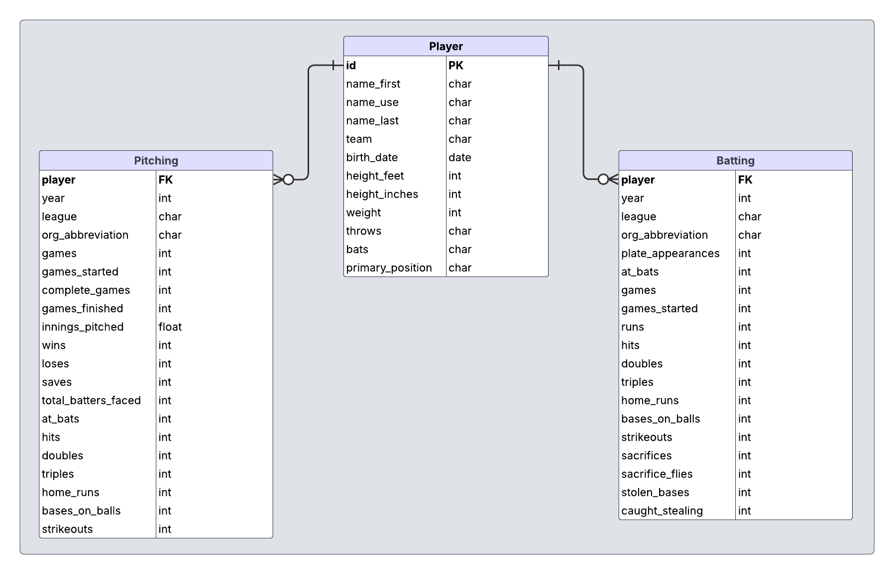

<table><tr>
<td align="center"></td>
<td align="center"></td>
<td align="center"></td>
<td align="center"></td>
</tr></table>
<!-- TABLE OF CONTENTS -->

  
Table of Contents

  <ol>
    <li>
      <a href="#about-the-project">About The Project</a>
      <ul>
        <li><a href="#omissions">Omissions</a></li>
        <li><a href="#built-with">Built With</a></li>
      </ul>
    </li>
    <li><a href="#installation">Installation</a></li>
    <li>
      <a href="#documentation">Documentation</a>
      <ul>
        <li><a href="#models">Models</a></li>
        <li><a href="#api">API</a></li>
      </ul>
    </li>
    <li><a href="#license">License</a></li>
    <li><a href="#contact">Contact</a></li>
  </ol>

<!-- ABOUT THE PROJECT -->
## About The Project
- This is a dashboard built to show various Major League Baseball stats.
- The primary frameworks are Django and Vue, but it also makes use of many other packages. See [Built With](#built-with) below.
- **Please Note**: I intentionally chose not to use a more professional looking UI template. This UI is relatively rudimentary because I am using it as a practice & learning tool and building everything fom scratch. 
- The project is in a "developer" stage only. There is no distribution. It is currently meant to run using the Django development server as the backend service and the Vite development server as the web server for the frontend.
- The data is a local JSON file located here `/data/players.json`. In a production environment the data source(s) will likely be much more varied, and "Extract" portion of the pipeline will of course need to be more robust.
- The database is Django's default SQLite. A production database is on the ToDo list.
- In production environment ETL, tools like Spark, dbt, Airflow etc, should be used. However for this demo, python *pandas* is used for the transformation and validation.
    - The need is small.
    - It allows the ETL process to be easily implemented as a custom Django admin command.
    - It allows me to demonstrate proficiency with pandas because it's always useful to have pandas in your back pocket :panda_face:
- Quick note: In my code I don't adhere strictly to 72 char lines. It's so short! I usually shoot for around 80ish. However I'm perfectly happy to adhere to any code standards, use formatters, prettifiers, etc.

(<a href="#readme-top">back to top</a>)

### Omissions

Again, this is an ongoing project. There are many things which are only minimally implemented at present (or not at all).
Some examples:
- Unit testing (minimal)
- Type hinting (not implemented)
- Responsive UI (minimal)
- CSS framework (minimal)

As the project moves forward I intend to more fully include these items and others.

(<a href="#readme-top">back to top</a>)

### Built With

Languages & environments:
- Python 3.12.5
- Node 23.7.0
- Implemented and tested on Ubuntu Linux 24.04

Packages:
- Django: 5.1.6
- Django Rest Framework: 3.15.2
- pandas: 2.2.3
- Vue: 3.5.13
- Pinia: 3.0.1
- Bootstrap: 5.3.3
- ChartJS: 4.4.8
- vue-chartjs: 5.3.2
- ag-grid-vue3: 33.1.1

(<a href="#readme-top">back to top</a>)

## Installation

*The following assumes `pip` and `npm` as the package managers*

After cloning the repo and changing to the dashboard-demo directory:

For the backend:
1. Create and activate a python virtual environment
2. Upgrade pip:
    - `python -m pip install --upgrade pip`
3. Install the python packages:
    - `pip install -r requirements.txt`
4. Make the Django DB migrations & migrate:
    - `python manage.py makemigrations`
    - `python manage.py migrate`
5. Optionally create a superuser for the Django admin:
    - `python manage.py createsuperuser`
6. Load the demo data using the included custom Django admin command. Note that some validation warnings will appear. This is intentional for demo purposes and they are ignored:
    - `python manage.py load_player_data ./data/players.json`
7. Run the Django dev server:
    - `python manage.py runserver`
8. The Django rest Framework provides an interface which can be used for testing the API. Eg: [http://127.0.0.1:8000/players/](http://127.0.0.1:8000/players/) (See below for endpoints)

For the frontend (in a separate shell):

1. Install the packages:
    - `npm install`
2. Run the Vite dev server:
    - `npm run dev`
3. The UI should now be accessible from: [http://localhost:5173/](http://localhost:5173/)

(<a href="#readme-top">back to top</a>)

## Documentation

- Default port numbers are used for both the Django dev server and Vite dev server.
- CORS is installed in Django and the Vite server is allowed as an origin.

### Models

Given the structure of the JSON data, the following relational architecture was created:

### API

Since the only requirement on the API is data retrieval, only a partial RESTful API was implemented:
| Method | Endpoint | Description | Query Params | Response |
| ---------- | ---------- | ---------- | ---------- | ---------- |
| GET | /players/ | Retrieve all players | stat=['all' \| 'batting' \| 'pitching'] | 200 OK (JSON array of players) |
| GET | /players/{id}/ | Retrieve a specific player | n/a | 200 OK (Player JSON) or 404 Not Found |
| GET | /players/{id}/stats/ | Retrieve stats for a specific player | n/a | 200 OK (Stats JSON) or 404 Not Found |

(<a href="#readme-top">back to top</a>)

## License

Distributed under the MIT License. See `LICENSE.txt` for more information.

(<a href="#readme-top">back to top</a>)

## Contact

Chris Zaleski - zaleski.chris@gmail.com

Project Link: [https://github.com/hobocz/dashboard-demo](https://github.com/hobocz/dashboard-demo)

(<a href="#readme-top">back to top</a>)

